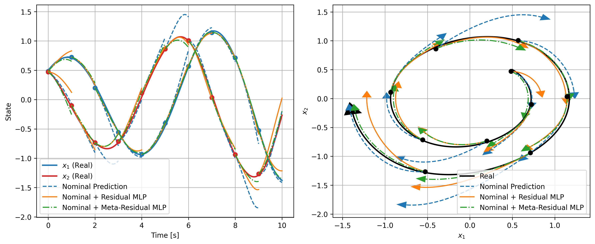
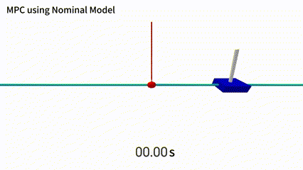
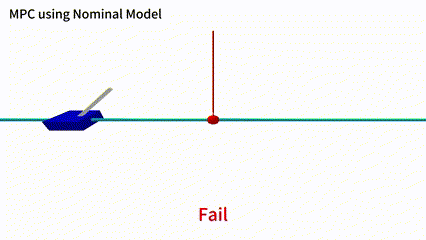
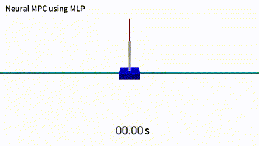

# Fast Online Adaptive Neural MPC via Meta-Learning

[](https://arxiv.org/abs/2504.16369)
[](https://www.youtube.com/watch?v=4K2QeBxWcWA)
[]()

This is the official implementation of the paper:  
[**"Fast Online Adaptive Neural MPC via Meta-Learning"**](https://arxiv.org/abs/2504.16369)  
by **Yu Mei**, **Xinyu Zhou**, **Shuyang Yu**, **Vaibhav Srivastava**, and **Xiaobo Tan**.

---

## 📑 Table of Contents
- [Fast Online Adaptive Neural MPC via Meta-Learning](#fast-online-adaptive-neural-mpc-via-meta-learning)
  - [📑 Table of Contents](#-table-of-contents)
  - [🎥 Demonstration Video](#-demonstration-video)
  - [🛠️ Installation Instructions](#️-installation-instructions)
  - [🚀 How to Run](#-how-to-run)
    - [1. Van-der-Pol Oscillator](#1-van-der-pol-oscillator)
    - [2. CartPole](#2-cartpole)
    - [3. 2D Quadrotor Stabilization and Tracking](#3-2d-quadrotor-stabilization-and-tracking)
      - [Stabilization Results](#stabilization-results)
      - [Tracking Results](#tracking-results)
  - [📚 Project Structure](#-project-structure)
  - [📝 Citation](#-citation)
---

## 🎥 Demonstration Video

<p align="center">
  <a href="https://www.youtube.com/watch?v=4K2QeBxWcWA">
    
  </a>
</p>

Watch our [**YouTube video**](https://www.youtube.com/watch?v=4K2QeBxWcWA) showcasing the control performance on the CartPole and 2D Quadrotor environments using the proposed Fast Online Meta-MPC framework.

---

## 🛠️ Installation Instructions

**1. Clone the repository**

   ```bash
   git clone https://github.com/yu-mei/MetaResidual-MPC.git
   cd MetaResidual-MPC
   ```

**2. Create a conda environment**

   ```bash
   conda env create -f environment.yml
   conda activate l4control
   ```

**3. Install `l4casadi`**

   Install the latest version using pip with `--no-build-isolation` (GPU/CUDA supported):

   ```bash
   pip install l4casadi --no-build-isolation
   ```

   > 🔗 Source: [github.com/Tim-Salzmann/l4casadi](https://github.com/Tim-Salzmann/l4casadi)

**4. Install acados and the acados Python interface**

   4.1 Clone and build Acados

   Follow the [official Acados installation guide](https://docs.acados.org/installation/index.html).

   4.2 Install the Acados Python interface

   Follow the [Python interface installation guide](https://docs.acados.org/python_interface/index.html).

**5. Install `safe-control-gym`**

   Follow the [official safe-control-gym installation guide](https://github.com/utiasDSL/safe-control-gym).

**6. Override PyTorch installation**

   Due to version conflicts between `l4casadi` and `safe-control-gym`, it is necessary to override PyTorch:

   ```bash
   conda install pytorch==2.5.1 torchvision==0.20.1 torchaudio==2.5.1 pytorch-cuda=12.4 -c pytorch -c nvidia
   ```

   > ⚠️ This ensures compatibility with both `l4casadi` and `safe-control-gym`.  
   > 🔧 Make sure your CUDA drivers are compatible with CUDA 12.4.

**7. Fix installation issues (if any)**

   If you encounter any remaining errors, manually install the missing or incompatible packages.  
   Package versions may vary depending on your system environment.

---

## 🚀 How to Run

### 1. Van-der-Pol Oscillator
We provide several scripts under `VanderPol/` for running different versions of the Van der Pol system using Meta-MPC:

| Script | Description |
|--------|-------------|
| `VanderPolSys_sim.py` | Simulates the nominal Van der Pol system. |
| `VanderPolSys_real.py` | Simulates the real system (with mismatched dynamics). |
| `VanderPolSys_naive.py` | Runs nominal MPC to predict the trajectories. |
| `VanderPolSys_naive_lightmlp.py` | Runs nominal MPC with a lightweight learned MLP model (learn from stratch)|
| `VanderPolSys_naive_meta.py` | Runs MPC using a meta-learned model. |
| `VanderPolSys_Collection_Meta.py` | Collects offline data for training the meta-learned model, and data file `vdp_meta_nominal_residual.py` is under dataset|
| `Comparsion.ipynb` | Jupyter notebook comparing performance across methods. |
| `MetaLearning/Offline_Train_Meta.py`| Training the Meta MLP offline using the data file `vdp_meta_nominal_residual.py`|

📌 Example: Run nominal MPC + Meta MLP

```bash
cd VanderPol
python VanderPolsys_naive_meta.py
```

After running the different methods and saving results in the `results/` folder, open `Comparsion.ipynb` to visualize and compare the performance.

<p align="center">
  
</p>

---

### 2. CartPole

We provide several scripts under `Cartpole/` to run different MPC controllers for the CartPole system using our Meta-MPC framework:

| Script | Description |
|--------|-------------|
| `cartpole_Nominal.py` | Runs MPC with a nominal (physics-based) model. |
| `cartpole_LightMLP.py` | Runs MPC using a learned residual MLP trained from scratch. |
| `cartpole_MetaMLP.py` | Runs MPC using a meta-learned residual MLP with online adaptation. |
| `cartpole_Nominal_seeds.py` | Batch test across seeds using nominal model. |
| `cartpole_LightMLP_seeds.py` | Batch test using residual MLP (non-meta). |
| `cartpole_MetaMLP_seeds.py` | Batch test using meta-residual MLP model. |
| `MetaLearning/DataCollection_Meta.py` | Collects residual training data for meta-learning. The output is saved in `meta_dataset_mpc/`. |
| `MetaLearning/Offline_Train_Meta.py` | Trains the Meta-Residual MLP model using the collected CSV dataset. |
| `meta_dataset_mpc/cartpole_meta_residual_mpc.csv` | CSV dataset collected from `DataCollection_Meta.py` used for offline meta-learning. |
| `Comparsion.ipynb` | Jupyter notebook to visualize and compare results across all methods. |

📌 Example: Run Meta-MPC with Online Adaptation

```bash
cd Cartpole
python cartpole_MetaMLP.py
```

📌 Example: Collect Residual Data for Meta-Training

```bash
python MetaLearning/DataCollection_Meta.py
```

📌 Example: Train Meta Residual MLP Offline

```bash
python MetaLearning/Offline_Train_Meta.py
```
---
After running all variants, results will be saved in the `results/` folder.  
Open `Comparsion.ipynb` to visualize metrics such as RMSE, trajectory tracking, and adaptation efficiency.

<p align="center">
  
  
  
</p>

<p align="center">
  <em>Left: Nominal MPC &nbsp; | &nbsp; Middle: Neural MPC + Residual MLP &nbsp; | &nbsp; Right: Neural MPC + Residual Meta-MLP</em>
</p>

---

### 3. 2D Quadrotor Stabilization and Tracking

We provide two folders for 2D Quadrotor control tasks using our Meta-MPC framework:

- `Quadrotor_2D_Stabilization/`: for stabilization tasks
- `Quadrotor_2D_Tracking/`: for reference trajectory tracking

Each folder contains scripts to run, which is similar as CartPole system:

📌 Example: Run Meta-MPC for Stabilization

```bash
cd Quadrotor_2D_Stabilization
python quadrotor2D_Meta.py
```

📌 Example: Run Meta-MPC for Tracking

```bash
cd Quadrotor_2D_Tracking
python quadrotor2D_Meta.py
```
---

#### Stabilization Results

<p align="center">
  
  
  
</p>

<p align="center">
  <em>Left: Nominal MPC &nbsp; | &nbsp; Middle: MPC + Residual MLP &nbsp; | &nbsp; Right: Neural MPC + Residual Meta-MLP</em>
</p>

---

#### Tracking Results

<p align="center">
  
  
  
</p>

<p align="center">
  <em>Left: Nominal MPC &nbsp; | &nbsp; Middle: MPC + Residual MLP &nbsp; | &nbsp; Right: Right: Neural MPC + Residual Meta-MLP</em>
</p>

---

## 📚 Project Structure

```
MetaResidual-MPC/
├── assets/                      # Demo GIFs and figures used in README (e.g., CartPole_MetaMLP.gif, Quadrotor_*.gif)
├── Cartpole/                    # Code for CartPole experiments
├── Quadrotor_2D_Stabilization/  # Code for 2D Quadrotor stabilization tasks
├── Quadrotor_2D_Tracking/       # Code for 2D Quadrotor trajectory tracking tasks
├── VanderPol/                   # Code for Van der Pol oscillator experiments
├── environment.yml              # Conda environment file
└── README.md                    # Project documentation
```

---

## 📝 Citation

If you find our work useful, please consider citing:

```bibtex
@article{mei2025fast,
  title={Fast Online Adaptive Neural MPC via Meta-Learning},
  author={Mei, Yu and Zhou, Xinyu and Yu, Shuyang and Srivastava, Vaibhav and Tan, Xiaobo},
  journal={arXiv preprint arXiv:2504.16369},
  year={2025}
}
```

---

